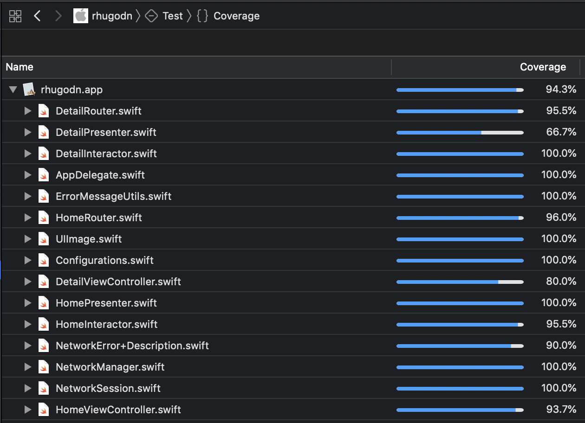
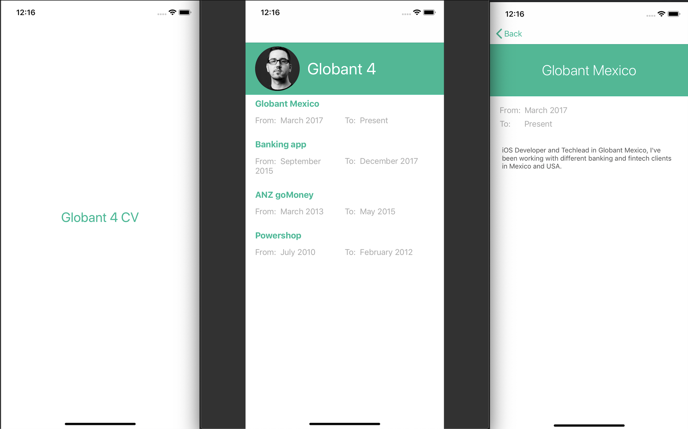

# Curriculum Vitae App

In this application I show my resume with a simple interface design.

## About the app

This project was development using VIPER architecture with the porpose to complete a code challenge. The app get the complete information from a [JSON](https://api.myjson.com/bins/sxj03). The design followed SOLID principles.

+ Architecture: View Presenter Interactor Entity Routing (__VIPER__)
+ Swift version: __4.2__
+ Xcode version: __10.1__

## Test

+ Unit Test
	+ Networking layer are testing use _mocking test_
	+ Also app's testing parsing correct and incorrect data

+ UI Test
	+ There are a simple tests of the table views, cells, labels and text views.

## Screenshots

